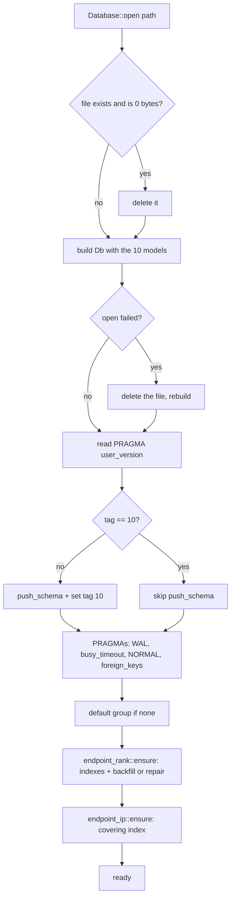
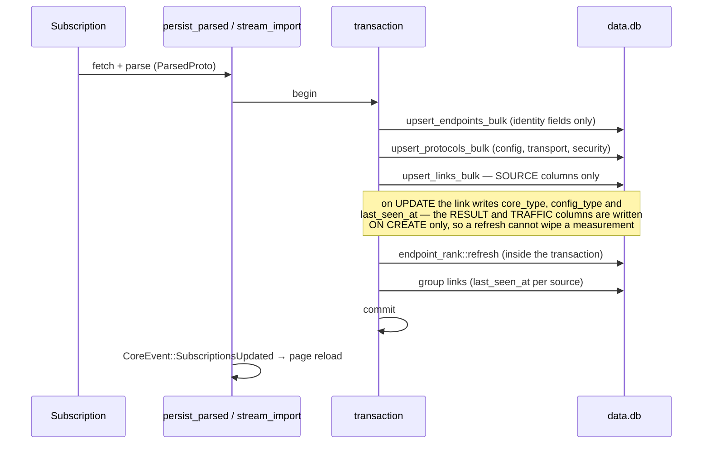
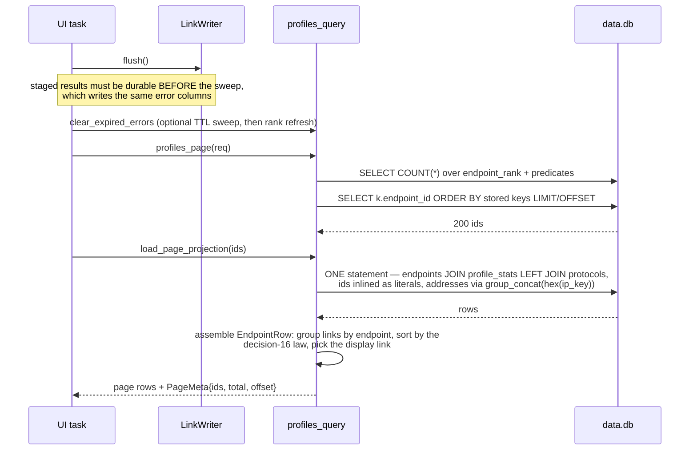
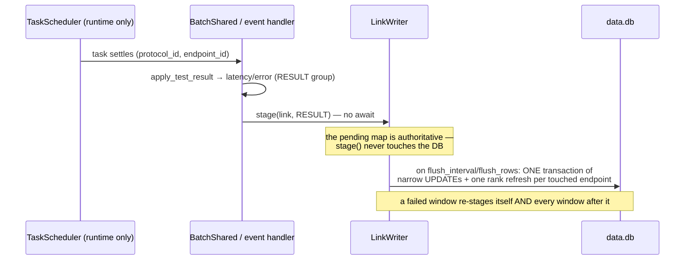
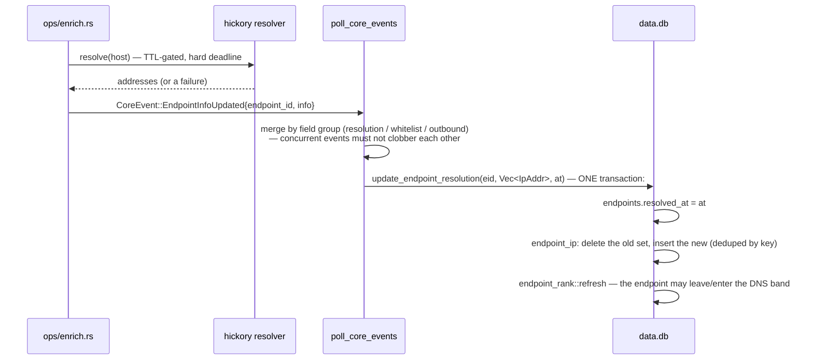
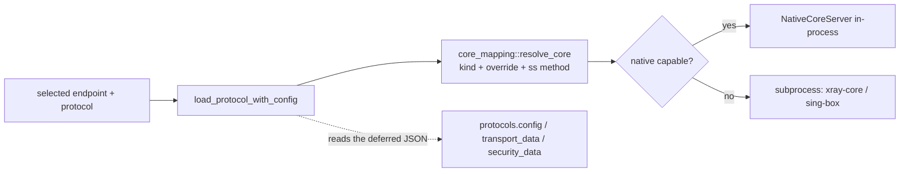

# Database

The TUI's persistent state is **one SQLite file** — `data.db` under the config
directory (`dirs::config_dir()/xray-tui/`, e.g. `~/.config/xray-tui/data.db`) —
opened through `toasty` 0.10 on the `toasty-driver-turso` backend (an
in-process, async SQLite-compatible engine). Nothing else is persisted except
the log store (LMDB, `logs.lmdb/`) and the geo mmdb.

`crates/xray-tui-db` owns it: `models_toasty.rs` declares every table,
`database.rs` holds every write/read method, `profiles_query.rs` holds the one
raw-SQL page engine, and `endpoint_rank.rs` / `endpoint_ip.rs` own the two
derived-state tables.

| | |
| --- | --- |
| Tables | 10 (listed below) |
| Schema tag | `PRAGMA user_version = 10` |
| Migrations | **none** — a tag mismatch deletes and recreates the file (see [Changing the schema](#changing-the-schema)) |
| Raw SQL | `profiles_query.rs` (the page), `endpoint_rank.rs` and `endpoint_ip.rs` (their index DDL plus the id-inlined reads/writes), and the bulk patch statements (ADR 0001, ADR 0003); `PRAGMA`s are the other standing exception, described under [Connection settings](#connection-settings) |

## Entity map

```mermaid
erDiagram
    endpoints ||--o{ endpoint_ip : "address set (ADR 0005)"
    endpoints ||--o{ profile_stats : "per-protocol state"
    endpoints ||--o{ endpoint_groups : "membership"
    groups ||--o{ endpoint_groups : "membership"
    protocols ||--o{ profile_stats : "config"
    endpoints ||--o| endpoint_rank : "ordering keys (ADR 0003)"
    groups ||--o{ routing_rules : "scoped rules"

    endpoints {
        BIGINT id PK "stable_hash(host, port)"
        TEXT host "canonical host string"
        TEXT host_type "ipv4|ipv6|dns|undefined"
        INTEGER port "primary port"
        TEXT ports "JSON array (multi-port specs)"
        TEXT last_source "hash of the source subscription"
        BIGINT manual_protocol_override "FK protocols.id, NULL = auto"
        BIGINT resolved_at "DNS attempt stamp (TTL gate)"
        BIGINT created_at "epoch seconds"
    }
    endpoint_ip {
        BIGINT endpoint_id PK
        BLOB ip_key PK "packed address, sortable"
    }
    protocols {
        BIGINT id PK "uid = sig ^ cred_hash"
        BIGINT sig "non-credential half / grouping key"
        TEXT proto_kind "27 protocol kinds"
        TEXT transport_type "tcp|ws|grpc|http|quic|kcp|http_upgrade|x_http"
        TEXT transport_data "JSON"
        TEXT security_type "none|tls|reality"
        TEXT security_sni "SNI (tls + reality)"
        TEXT security_fp "fingerprint"
        BOOLEAN security_insecure
        TEXT security_data "JSON"
        TEXT config "JSON ProtocolConfig"
        BIGINT created_at
    }
    profile_stats {
        BIGINT protocol_id PK "FK protocols.id"
        BIGINT endpoint_id PK "FK endpoints.id"
        TEXT core_type "xray|sing_box (per-pair)"
        TEXT config_type "share_url|form"
        BIGINT last_used_at
        BIGINT last_seen_at "staleness + retention"
        TEXT latency "real|fast, NULL = untested"
        INTEGER latency_delay "ms"
        TEXT latency_ip "exit IP of a real ping"
        BIGINT speed_bps
        BOOLEAN error "failure marker flag"
        TEXT error_kind "real|fast|name"
        TEXT error_text
        BIGINT traffic_today_up
        BIGINT traffic_today_down
        BIGINT traffic_total_up
        BIGINT traffic_total_down
        BIGINT created_at
        BIGINT updated_at
        INTEGER version "optimistic concurrency"
    }
    endpoint_groups {
        BIGINT endpoint_id PK
        TEXT group_id PK
        BIGINT last_seen_at "per-source confirmation"
        INTEGER sort_order
    }
    groups {
        TEXT id PK "uuid"
        TEXT name
        TEXT url "subscription URL"
        BOOLEAN enabled
        TEXT user_agent
        TEXT convert_target "clash"
        TEXT core_type "auto|xray|sing_box"
        INTEGER sort_order
        BIGINT last_refreshed
        TEXT status "ok|error|never"
        TEXT error_message
        BIGINT refresh_interval "minutes"
    }
    routing_rules {
        TEXT id PK
        TEXT group_id "NULL = global"
        INTEGER type "opaque"
        TEXT domain_matcher
        TEXT domains "JSON array"
        TEXT ips "JSON array"
        TEXT inbound_tags "JSON array"
        TEXT ports "JSON array"
        TEXT source_ports "JSON array"
        TEXT network
        TEXT protocols "JSON array"
        TEXT domain_strategy
        TEXT outbound_tag
        TEXT balancer_tag
        TEXT rule_set_file
        TEXT rule_set_url
        INTEGER sort_order
    }
    dns_settings {
        TEXT id PK
        TEXT name
        TEXT servers "JSON array"
        TEXT hosts "JSON array"
        TEXT query_strategy "use_ip|use_ipv4|use_ipv6"
        BOOLEAN disable_cache
        BOOLEAN disable_fallback
        TEXT client_ip
        BIGINT cache_ttl_secs
    }
    route_probes {
        TEXT id PK "singleton: 'global'"
        TEXT hosts "JSON array"
    }
    endpoint_rank {
        BIGINT endpoint_id PK
        BIGINT rank_dns "1 = DNS-unresolved (tier 5)"
        BIGINT rank_tier "0 real-ok .. 5 dns"
        BIGINT rank_latency "i32::MAX outside tiers 0-1"
        BIGINT rank_seen "representative link last_seen_at"
        BIGINT rank_protocol "order tiebreak"
        BIGINT rank_display_seen "display link recency"
        BIGINT rank_speed
        BIGINT rank_traffic
        BIGINT rank_config "form 0, share_url 1, other 2"
        BIGINT rank_newest_seen "view windows"
    }
```

`toasty` emits **no SQL `REFERENCES`**: the arrows above are ownership, not
constraints. Deletion order is explicit in the deletion owners
(`delete_endpoints`, `purge_expired`) — child rows first, in one transaction.
Cardinality note: every arrow out of `endpoints` and into `endpoint_rank` is
*optional*, because a linkless endpoint is a legal row — it has no
`profile_stats` links, so nothing to order — and `compute_rank` returns `None`
for it (it is the `min()?` over the links), `repair_missing` only fills
endpoints that have links, and `prune` drops the key of an endpoint whose links
went away.

## Tables

### Identity and addresses

**`endpoints`** — one row per `host:port`. `id` is a stable hash
(`stable_hash(host, port)`; exotic kinds hash `("undefined", config_uid)`, which
is why `host` can be empty). `host_type` decides how the row is dialled: an
`ipv4`/`ipv6` host needs no resolution, a `dns` host resolves into
`endpoint_ip`. `ports` carries a multi-port spec (JSON array, empty when the
single `port` is the whole spec).

**`endpoint_ip`** — a DNS endpoint's resolved addresses, **one row per address**
(ADR 0005). The PK `(endpoint_id, ip_key)` makes the set deduped; `ip_key` is
the address itself in a sortable packed encoding — a family byte (`4` = IPv4,
`6` = IPv6, the `IpAddr` discriminant) then the big-endian octets, 5 or 17
bytes, so B-tree byte order *is* address order with IPv4 first. The text form
exists only at the display edge (`crate::endpoint_ip::ip_of` → `IpAddr`).
`endpoints.resolved_at` is a *different* fact: the stamp of the last lookup
attempt, which the resolution TTL reads — a failed lookup stamps it and leaves
the address set empty, and that empty set is what the tier-5 band means.

### Config

**`protocols`** — one row per distinct protocol configuration. `id` is the
identity uid `sig ^ cred_hash` (`xray-tui-proto`'s per-kind binary writer over
non-default, explicitly-set fields only); `sig` is kept because it is the
"same way configured servers" grouping key. Host and port are **not** part of
the identity, so one protocol serves many endpoints. `config` holds the full
typed `ProtocolConfig` as JSON; `transport_data`/`security_data` hold the
nested transport/security configs, and the scalar columns beside them
(`transport_type`, `security_type`/`sni`/`fp`/`insecure`) are the display
projections the page reads without touching the JSON. Changing what the identity
covers re-keys every row — it is a data reset, never a migration (decision 11).

**`profile_stats`** — the per-`(protocol, endpoint)` pair state: everything a
test measures and everything traffic counts. The three embeds are flattened
into columns, so one "row" in mermaid is `latency`+`latency_delay`+`latency_ip`,
`error`+`error_kind`+`error_text`, and the four `traffic_*` counters.
`#[version]` makes typed single-row updates optimistic-concurrency safe; the
bulk patch path bumps it manually. Writers are disjoint by column group
(`LinkGroups::RESULT` vs `TRAFFIC`) so a ping result and the stats poller can
never clobber each other (decision 22).

### Grouping

**`groups`** — a subscription/group: URL, refresh interval, last status. A
group is *not* a container that owns endpoints; membership is the many-to-many
link below, and an endpoint may belong to none (the All view shows it).

**`endpoint_groups`** — the many-to-many membership link, carrying the
per-source confirmation stamp (`last_seen_at`, refreshed by every import from
that source) and an optional display order.

### Routing, DNS, probing

**`routing_rules`** — the routing table's rows, ordered by `sort_order`; the
list-valued columns are JSON arrays of text (note `ports`, the one
`Vec<u16>`). `group_id` scopes a rule to a subscription's endpoints; `NULL`
means global. `type` is an opaque integer carried for the form only.

**`dns_settings`** — the DNS configuration rows (`servers`/`hosts` are JSON
arrays; `cache_ttl_secs` is the TUI-side resolution cache TTL).

**`route_probes`** — a single row (`id = 'global'`) holding the hostnames the
routing engine must resolve.

### Derived state

**`endpoint_rank`** — the materialized per-endpoint ordering keys (ADR 0003).
Each row is the decision-16 law evaluated for one endpoint over its links; the
page's default order is an index scan of `endpoint_rank_test`, which is why the
Profiles tab stays fast at any offset. The values are computed **in Rust** by
`endpoint_rank::RankLink::key` — the single implementation of the law, shared
with the panel's link order — and never re-derived in SQL. `rank_dns` is the
"DNS host with no address" flag; `rank_newest_seen` answers the Active/Stale
window.

## Indexes

| Index | Table / columns | Serves |
| --- | --- | --- |
| *(PK autoindex)* | `endpoints(id)` | every by-id lookup, all hydration |
| *(PK autoindex)* | `endpoint_ip(endpoint_id, ip_key)` | the address set of an endpoint (prefix seek), PK uniqueness |
| `endpoint_ip_by_key` *(raw)* | `endpoint_ip(ip_key, endpoint_id)` | address-ordered scans, `min(ip_key)` per endpoint, range lookups by address |
| *(PK autoindex)* | `profile_stats(protocol_id, endpoint_id)` | pair lookups, the patch existence probe |
| `index_profile_stats_by_protocol_id` | `profile_stats(protocol_id)` | per-protocol reads |
| `index_profile_stats_by_endpoint_id` | `profile_stats(endpoint_id)` | the page's per-endpoint link reads |
| `index_profile_stats_by_last_seen_at` | `profile_stats(last_seen_at)` | retention cutoff, staleness windows |
| *(PK autoindex)* | `endpoint_groups(endpoint_id, group_id)` | membership lookups |
| `index_endpoint_groups_by_endpoint_id` | `endpoint_groups(endpoint_id)` | an endpoint's groups |
| `index_endpoint_groups_by_group_id` | `endpoint_groups(group_id)` | a group's endpoints (the query) |
| *(PK autoindex)* | `endpoint_rank(endpoint_id)` | rank-row writes/lookups |
| `endpoint_rank_test` *(raw)* | `endpoint_rank(rank_dns, rank_tier, rank_latency, rank_seen DESC, rank_protocol, endpoint_id)` | the default page order — a covering index, so the page is an index scan (~8.6 ms at 7,672 endpoints, ADR 0003) |
| `endpoint_rank_window` *(raw)* | `endpoint_rank(rank_newest_seen)` | the Active/Stale window and the count |

The two raw sets exist because toasty's `#[index]` is single-column and cannot
express a mixed-direction composite. They are created with
`CREATE INDEX IF NOT EXISTS` at every open, so they are additive and
idempotent. `endpoint_ip` deliberately carries **no** `#[index]` on
`endpoint_id`: it is the composite PK's first column, so the autoindex already
serves that prefix (unlike `profile_stats.endpoint_id`, which is the *second*
PK column and therefore needs its own index).

## Derived state and who maintains it

Two tables are derived, and a write that changes their inputs **must** refresh
them, or the page silently lists a stale position:

- `endpoint_rank` follows every link change: `upsert_link`,
  `upsert_links_bulk` (inside the caller's transaction), `apply_link_patches`
  (after commit), `update_last_used`, `update_endpoint_resolution`,
  `set_manual_override`, `restore_endpoint`, `clear_all_stats` (wholesale
  `backfill_all`), and the error-TTL sweep. `repair_missing` runs at open and
  is exposed as `Database::repair_endpoint_ranks`; `prune` runs inside the
  deletion transactions.
- `endpoint_ip` is rewritten as a set by its single writer,
  `update_endpoint_resolution` (delete-then-insert, deduped by key), in the
  same transaction as the endpoint's `resolved_at` and the rank refresh.
  Deletions go through `endpoint_ip::delete_for` inside the same transaction as
  the endpoint rows.

## Connection settings

Every pooled connection is acquired through `Database::conn()`, which sets
`PRAGMA busy_timeout=5000` and `PRAGMA synchronous=NORMAL`; `open()` additionally
sets `journal_mode=WAL` and `foreign_keys=ON`. `busy_timeout` and `synchronous`
are per-connection pragmas: setting them once at open never reaches
pool-created connections, which is what produced the historical
"database is locked" storms. WAL + `synchronous=NORMAL` is the deliberate
durability trade (commits are not individually fsynced); the default `FULL`
costs ~4.2 ms per commit and a ping batch issues tens of thousands of them.

## Flows

### Open (and schema creation)

### Import / subscription refresh

### Profiles page load

Why one statement and inlined ids: turso charges ~0.8 ms per *bound*
parameter, so the typed hydration (three `IN (...)` reads, ~600 binds) cost
488 ms per page against 49.6 ms for the same rows from one inlined statement
(ADR 0001). The typed path (`load_page_rows`) survives as the parity oracle.

### Ping result (batch and single)

### DNS enrichment

### Connect

## Query map

| Call | Statement | Notes |
| --- | --- | --- |
| `profiles_page` | count + ordered ids | drives from `endpoint_rank`; the default order is a covering-index scan |
| `profiles_anchor` | count of rows sorting before a key tuple | used to re-anchor the window after a re-sort moved the selection |
| `load_page_projection` | one hydration statement, ids inlined | the page's rows (display columns only; the three deferred JSON carriers stay unloaded) |
| `load_page_rows` | typed `in_list` reads + in-memory join | the reference implementation the projection is pinned against |
| `update_endpoint_resolution` | `UPDATE endpoints` + `endpoint_ip` set rewrite + rank refresh | one transaction, retried on write contention |
| `apply_link_patches` | one literal `UPDATE` per row + existence probe per chunk | the write-behind flush path |
| `endpoint_rank::refresh` / `backfill_all` / `repair_missing` | raw, id-inlined reads + a bulk upsert | never binds ids (~0.8 ms each) |

## Changing the schema

1. **Add a column or table** to `models_toasty.rs` (or raw DDL at open for tables
   toasty cannot express — currently only the two index sets).
2. **Bump `SCHEMA_VERSION`** in `database.rs`. That is not a migration: a
   mismatched `user_version` makes `open()` **delete the file** and rebuild it
   empty (decision 4). The project is pre-alpha and treats the database as
   re-importable fixture data — but a bump still destroys user data, so it is a
   deliberate call, never a convenience.
3. **If the change touches identity** (any field a protocol's `write_identity`
   writes), also bump `IDENTITY_VERSION` in `xray-tui-proto` and re-pin the
   identity goldens: stored uids become unrelated values, so the wipe in step 2
   is mandatory, not optional.
4. **Raw SQL stays exceptional.** Add it only where the engine's cost model
   forces it (the page, the id-inlined rank reads, the bulk patch writes), keep
   it parameterised-or-integer-inlined, keep it read-only where possible, and
   add a statement-vs-schema drift test.

## Known limits

- The page load carries a measured **+3.8 ms (unresolved page) to +6.1 ms
  (fully-resolved page)** over the previous JSON column, and the file is ~7.5%
  larger on a 1–3-address feed — the price of the address set being relational.
  Both alternatives (reading the flag from `rank_dns`, or reading addresses in
  a second statement) measured *worse*; the remaining lever is a materialized
  `endpoint_rank.rank_ip` key (166.9 ms → 0.94 ms for the IP sort), deliberately
  not taken. See `docs/aegis/specs/2026-09-15-endpoint-ip-storage-design.md`.
- The IP sort is not index-driven (a correlated `min(ip_key)` per row): ~166 ms
  per fetch, in the same band as the pre-existing Address/Port sorts.
- `endpoint_ip.ip_key` cannot be produced or ordered by the engine's own `inet`
  type: it is declared without `OPERATOR '<'`, so `ORDER BY`/`CREATE INDEX` on
  such a column are parse errors, and an operator-declared variant orders the
  text (`10.0.0.1 < 9.0.0.1`). Hence the packed key.
