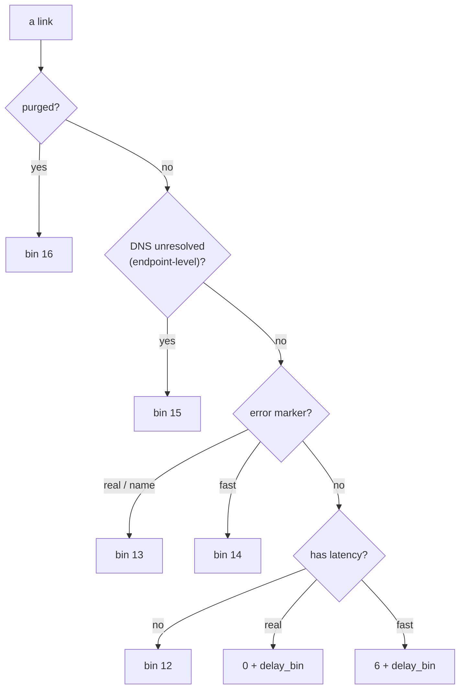
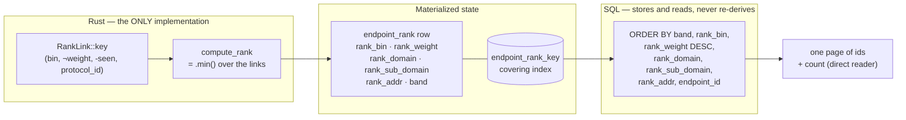

# The ordering law

How the Profiles tab decides which endpoint is "best", why that decision is
computed **once** in Rust and stored, and how one covering index turns the page
into an index scan at any offset.

Authority in code: `crates/xray-tui-db/src/endpoint_rank.rs`
(`RankLink::key`, `compute_rank`), `crates/xray-tui-proto/src/proto_spec/weight.rs`
(the static weight), `crates/xray-tui-db/src/profiles_query.rs` (the SQL order),
`crates/xray-tui-db/src/models_toasty.rs` (`EndpointRow::link_test_key`).
Decisions: `AGENTS.md` 15/16; ADRs 0003 (stored keys), 0006 (purge),
0010 (band), 0011 (rewamp).

## 1. What the law answers

One question, asked of every endpoint: **if a user activates this endpoint, which
of its links will it dial, and how good is that link versus every other
endpoint's?**

That is two nested questions, and the code answers them with two *different*
keys — this separation is the whole design:

| | question | key | scope |
| --- | --- | --- | --- |
| **link key** | which of *this* endpoint's links represents it? | `(bin, ¬weight, -seen, protocol_id)` | within one endpoint |
| **endpoint key** | where does the endpoint sit on the page? | `(band, bin, ¬weight, domain, sub_domain, addr, endpoint_id)` | across the feed |

The link key **selects** (the endpoint's representative link); the endpoint key
**orders** (the page). The link key's recency term (`-seen`) is deliberately
absent from the endpoint key: recency decides *which* link represents an
endpoint, not where that endpoint ranks.

Both are ascending tuples compared by a single `.min()` / `ORDER BY`. There is
no `Reverse`, no wrapper type, no second comparator — a fork in the comparison
is what makes orderings drift.

### 1.1 The link key

```
(bin, u64::MAX - weight, -seen, protocol_id)
```

* `bin` — the coarse measurement band (§2). Lower is better.
* `u64::MAX - weight` — the static config weight (§3), **negated** so "higher
  weight = better" rides an ascending tuple. This is the same idiom as `-seen`:
  one plain ascending key, no `Reverse`.
* `-seen` — newest link wins a tie.
* `protocol_id` — a stable final tiebreak, so the order is total.

### 1.2 The endpoint key

```
(band, bin, u64::MAX - weight, domain, sub_domain, addr, endpoint_id)
```

The first three terms are the *representative link's* `(bin, weight)` (the
`.min()` of §1.1, with `-seen`/`protocol_id` dropped). The tail is the
**address tiebreak**: the endpoint's registrable domain, its sub-domain labels
and (for an IP host) its packed literal — so two equally-ranked endpoints still
order deterministically and, usefully, alphabetically by host.

`band` leads because it is the one term the page *filters* on (§5): with it
first, an Active page is a covering **seek** (`band = 0`) and the All view a
covering **scan**, both in index order and neither with a temp b-tree.

## 2. The bin — measurement, coarsened

The `bin` replaces the old `(tier, latency)` pair. Raw latency cannot lead the
endpoint key: it is a `i32` with `i32::MAX` sentinels, and a single noisy probe
would reorder the feed. Bucketing it keeps the *intent* ("did something work,
and roughly how fast") while making the key a small dense integer.

| bin | meaning | | bin | meaning |
| --- | --- | --- | --- | --- |
| 0 | real, < 50 ms | | 6–11 | fast success, same 6 delays |
| 1 | real, < 100 ms | | 12 | untested (no latency) |
| 2 | real, < 250 ms | | 13 | real/name error marker |
| 3 | real, < 500 ms | | 14 | fast error marker |
| 4 | real, < 1000 ms | | 15 | DNS host, unresolved |
| 5 | real, ≥ 1000 ms | | 16 | purged |



`delay_bin(d)` = `<50 → 0, <100 → 1, <250 → 2, <500 → 3, <1000 → 4, ≥1000 → 5`.

Two properties the numbering encodes, both load-bearing:

* **A real measurement outranks a fast one of any delay.** The real bands are
  `0..5`, the fast bands `6..11`, so no fast result can reach a real band. A
  fast probe is a TCP handshake; a real probe dials through the tunnel and
  fetches. They are not the same evidence.
* **`dns unresolved` (15) sits below every measured band but above nothing
  else**, and is an *endpoint*-level fact, not a link fact — every link of an
  unresolved endpoint collapses to it (§6).

Bins 13/14 fold the persisted failure marker; 16 is the purge sink (§5).

## 3. The static config weight

The weight answers the one question measurement cannot: **among links nothing
has probed yet, which stack should be tried first?** It is a compiled *taste
table*, not a measurement (`proto_spec/weight.rs`).

Four coarse bands, in precedence order, packed into `ConfigWeight`
(`#[repr(C)]`, `Ord` derived from field order):

| band | axis | higher means | real values (`/10`) |
| --- | --- | --- | --- |
| `security` | which security | stronger prior | reality 10, tls 6, none 2 |
| `mimicry` | DPI detectability of the (transport, security) pair | harder to fingerprint | tcp+reality 10 … kcp 2 |
| `sec_cost` | security-layer cost, inverted | cheaper handshake | none 10, tls 6, reality 3 |
| `transport_cost` | transport cost, inverted | cheaper transport | tcp 10 … kcp 3 |

Three design rules, each following from "this is a prior, not a model":

* **Coarse bands (0..=10).** Declaration order IS precedence, so `security`
  decides unless two stacks tie on it *exactly*. With fine-grained values the
  lower three bands would only ever be read on exact ties and the whole weight
  would degenerate to "pick the best security". Coarse bands are a constraint.
* **Exhaustive lookups, no `_` arm.** A new `TransportType` or `SecurityType`
  variant is a **compile error** here, never a silent zero that sinks every row
  of that shape to the bottom of the page.
* **Versioned (`WEIGHT_VERSION`).** The tables are code, so an edit silently
  invalidates every *stored* weight. The DB compares the version at open and
  recomputes all keys on a mismatch (`rank_weight_meta`).

Only `security`, `mimicry` move on `sni`/`fp`; protocol **kind** is not a
dimension (VLESS/VMess/Trojan over the same stack score identically), and no
sub-config fact (ws `path`, kcp `header_type`) is read — the function takes only
the scalar discriminator columns the DB already stores.

### 3.1 Why the weight outranks latency inside a bin

Deliberate and accepted: a 900 ms REALITY link sorts above a 40 ms plain-TCP one
*when both land in the same bin*. The bins are coarse, so "same bin" means
"within the same rough delay class" — and inside one class, the stack that is
likelier to survive a hostile network is the better guess. The cost is accepted
in exchange for a stable, probe-noise-resistant order.

## 4. From law to page: the derivation pipeline



**Rust owns the law; SQL owns only the numbers.** `EndpointRow::link_test_key`
delegates to `RankLink::key`, so the panel's link order, the stored keys, and
the parity golden are the same function. SQL is never allowed to re-derive the
order from raw columns — that is the duplication ADR 0003 exists to prevent.

The stored `rank_weight` is the weight of the link the law *picked* (the
representative), so the stored bin and stored weight always describe the same
link, by construction.

### 4.1 The negation ↔ the stored BLOB

`u64::MAX - weight` and `ORDER BY rank_weight DESC` are the **same order**:

* The weight is stored as 8 big-endian bytes (`ConfigWeight::to_be_bytes`),
  field 1 most significant, so byte-order memcmp = lexicographic order.
* The Rust key negates the packed `u64`, which is ascending = descending in the
  stored bytes.
* SQL therefore asks for `rank_weight DESC` and gets exactly the comparator's
  order. Flipping that term to `ASC` inverts the page against the oracle — the
  parity test fails, not a field.

## 5. Materialization, the index, and the view window

`endpoint_rank` is **derived state**, one row per endpoint, rewritten whenever a
link changes (`endpoint_rank::refresh`, inside the same transaction as the link
write). One covering index serves every page order:

```
endpoint_rank_key(band, rank_bin, rank_weight DESC, rank_domain, rank_sub_domain, rank_addr, endpoint_id)
```

| page | plan | why |
| --- | --- | --- |
| Active, Test | `SEARCH … USING INDEX endpoint_rank_key (band=?)` | `band` is constant → seek, no sorter |
| Purgatory, Test | same, `band = 1` | same shape |
| All, Test | `SCAN … USING COVERING INDEX` | `band` leads → index order, no sorter |
| scoped batch (`rank_bin IN …`) | covering scan, bin predicate inline | no extra index needed |

**Trap, pinned by the turso gate:** a literal `band IN (0,1) ORDER BY key`
filesorts (`USE SORTER FOR ORDER BY`). The All view therefore orders by the
mixed `band` column, never by a filter on it.

`band` is the Active/Purgatory window: `0` when `rank_newest_seen >= now −
active_ttl`, else `1`. `rank_newest_seen` is the newest **live** link's
`last_seen_at`; an all-purged endpoint takes `NO_SEEN` (`i64::MIN`), which is
below every window bound — exactly "it belongs to Purgatory". That is why a
single index range serves both populations.

`rank_weight` is a **raw `NOT NULL`** column (the toasty model has no seat for
one, and declaring it there would need a schema-tag wipe). `NOT NULL` is
load-bearing: `profiles_anchor` binds every ordering term's value back into a
comparison, so a NULL weight is a query *error*, not a mis-sort. `write`'s
follow-up `UPDATE` re-sets `band` after the `INSERT OR REPLACE` but **not**
`rank_weight` — the weight is Rust-computed and already in the insert values.

## 6. The resolution band and purge sink

Two endpoint-level overrides sit above the measured bands:

* **DNS unresolved (bin 15).** A DNS host with no address row collapses every
  link into bin 15 (`dns_unresolved_endpoint(domain, has_address)`). A failed
  lookup is the same state: it stamps `resolved_at` and leaves the address set
  empty. An IP literal is *not* this state — its address is its `endpoint_ip`
  row.
* **Purged (bin 16).** A link carrying a `purge_reason` sits below every live
  band, so an endpoint's representative link is a live one whenever any live
  link exists. An all-purged endpoint still gets a deterministic position, for
  the Purgatory/All views (ADR 0006).

## 7. Search

`PageRequest.search` is a **prefix** predicate over the same index columns —
a prefix of `domain` or of `sub_domain`, or, when the term parses as an IP/CIDR,
a byte range on the packed `rank_addr`:

```
k.rank_domain     >= x AND k.rank_domain     < x + '\u{10ffff}'   -- prefix
k.rank_sub_domain >= x AND k.rank_sub_domain < x + '\u{10ffff}'   -- prefix
k.rank_addr       >= lo AND k.rank_addr      < hi                  -- IP/CIDR range
CAST(e.port AS TEXT) LIKE '%x%'                                    -- port, substring
```

The range end is the term plus `U+10FFFF` (above every real code point), so the
scan is an index seek — never `LIKE '%…%'` over the feed. The **port** keeps its
substring match; every other clause is a prefix. Not a substring, not a suffix,
not the assembled full host — the assembled host is not stored. Two spellings of
one address (text + packed) do not exist; the packed key is the only IP fact.

## 8. Measurements

| path | before | after | notes |
| --- | --- | --- | --- |
| page fetch, Test (7,672 endpoints) | 1757 ms | **8.6 ms** | `ROW_NUMBER()` window → covering index (ADR 0003) |
| page fetch, Test (74,723-endpoint real feed) | 108.4 ms | — | toasty exec path, the pre-T13 baseline |
| page fetch, Test @ 50k scale | — | **~1.5 ms** | direct turso reader + binned index (T13) |
| Active Test @ 50k, offsets 0 / 12.5k / 24.8k | — | **1.47 / 2.11 / 2.79 ms** | `SCAN … USING COVERING INDEX`; flat in offset |
| Active Port (filesort, not index-served) @ 50k | — | 33.3 / 34.9 / 34.3 ms | the cost of a sort the index does not cover |

The page is flat in offset because it is an index scan — a deep `OFFSET` walks
the index, not a re-sorted table.

## 9. What is retired

| gone | replaced by |
| --- | --- |
| `ROW_NUMBER() OVER (…)` window sort per page | stored keys + covering index |
| `SortColumn` / the sort cycle / `AppState.sort_column` | the law only (decision 16, D1) |
| `rank_dns`/`rank_tier`/`rank_latency`/`rank_seen`/`rank_protocol`/`rank_display_seen`/`rank_speed`/`rank_traffic` | `rank_bin`, `rank_weight`, `rank_domain`, `rank_sub_domain`, `rank_addr` |
| `PageSort::Address` + the `rank_host` column + `endpoint_rank_band_host` | the Test key's `rank_domain`/`rank_sub_domain`/`rank_addr` tail (no production caller) |
| `endpoint_rank_test`, `endpoint_rank_test_v2`, `endpoint_rank_window` | one `endpoint_rank_key` |

`PageSort` keeps `Port` and `Ip` for the perf lab; `Ip` is additionally the
search range index's rationale (`endpoint_ip_by_key`).
