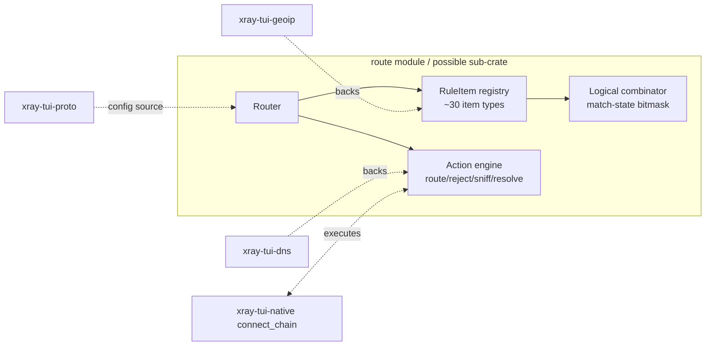
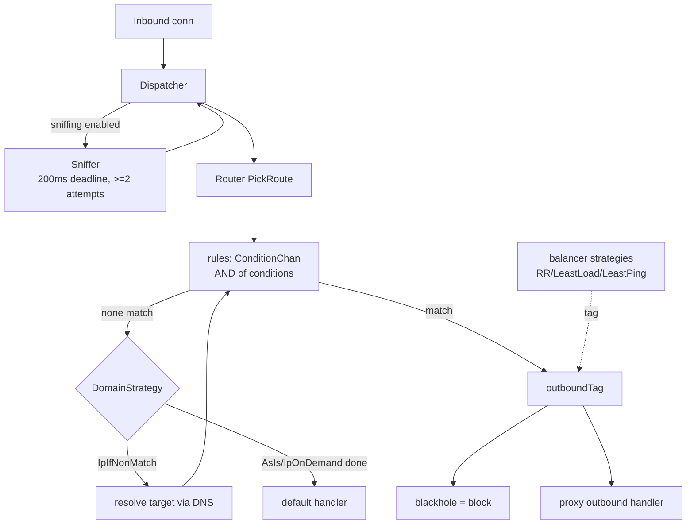

# Native Routing Engine — Design Decision Document

**Status:** proposal under discussion (brainstorming phase)
**Date:** 2026-08-27
**Scope:** routing subsystem for `xray-tui-native` (in-process Rust proxy core)

---

## 1. Context and Goals

Today `xray-tui-native` is a **target-fixed dialer**: `connect*` (`src/lib.rs`, `src/chain.rs`)
dials one endpoint through `dial → security → transport → protocol` and returns a tunnel.
There is no dispatcher, no inbound listener, and no rule engine inside the native crate.
Routing exists only for the *spawned-core* path: `RoutingRule` rows
(`crates/xray-tui-db/src/models_toasty.rs:306`) are compiled into xray `routing` /
sing-box `route` JSON blocks by the config builders (`crates/xray-tui-core/src/config_builder/{xray,singbox}.rs`).

This document evaluates three architectural models for adding upstream-parity routing
to the native core, fitted to this repository's structure:

- `xray-tui-dns` — DNSCrypt/hickory resolver, already TTL-cached; natural backing for a `resolve` action.
- `xray-tui-geoip` — GeoLite2-City mmdb lookup; extendable to country/CIDR geo matching.
- `xray-tui-host-features` — whitelist membership checks (a crude ancestor of rule-set matching).
- The existing DB `RoutingRule` row shape (Xray-flavored columns).
- A new dedicated sub-crate is acceptable if layering demands it.

### Success criteria

1. Upstream parity: every match dimension and action Xray or sing-box supports is expressible.
2. First-match semantics identical to both upstreams (linear order, default-outbound fallback).
3. No eager networking on the hot path unless a rule needs it (lazy sniff/resolve).
4. Reuses existing crates instead of duplicating DNS/geo logic.
5. Verification integrated with the three-tier gate already used by native/tls
   (`NATIVE_CORE.md`): hermetic unit tests = CI gate; live grader optional;
   real-core e2e where wire behavior matters.

---

## 2. What Upstream Actually Does

Findings from the third-party sources (read-only references):

| | Xray-core | sing-box | shoes |
|---|---|---|---|
| **Shape** | Dispatcher → router.PickRoute | Router IS the dispatch chain (inline action pipeline) | ClientProxySelector linear scan |
| **Rule model** | AND-ed conditions per rule (`ConditionChan`) | Flat rules AND their typed RuleItems; Logical rules add `\|\|` + invert via match-state bitmask | `(NetLocationMask, Allow{chain pool}/Block)` pairs |
| **Match fields** | domains (full/domain/substr/regex via geosite), geodata IPs (`geoip:` incl `private:`), source/local/target IP+ports, vless-route ports, networks tcp/udp, inboundTag, protocol (prefix), user email (exact+regexp), HTTP attributes, process name/path, local OS, webhook | domain/keyword/regex, CIDR, private-IP, port(range), sniffed protocol, network, inbound/outbound tags, clash-mode, auth user, user id, process name/path(+regex), package name, query type (DNS), wifi ssid/bssid, ip-version, network type/expensive/constrained, rule-set refs | CIDR + port range masks only |
| **Actions** | target tag only (block = blackhole *outbound*, not router action); balancers select among outbounds (RoundRobin/LeastLoad/LeastPing + observatory) | route (override addr/port), route-options, bypass, direct, reject (drop/default/reply), hijack-dns, sniff, resolve | Allow{override address, chain round-robin}/Block |
| **DNS interplay** | global DomainStrategy AsIs/IpIfNonMatch/IpOnDemand; resolve-once-no-match then re-run ALL rules; SkipDNSResolve loop guard | per-rule actions: sniff and resolve fire between ordered rules; metadata.DestinationAddresses populated lazily | hostname rules trigger DNS only if `resolve_rule_hostnames` set |
| **Matcher tech** | compiled: MPH perfect-hash (hash-displace) + Aho-Corasick automata + label tries, shared via WeakCacheMap across geo instances | ~30 small single-field item structs; bitmask match-states for AND/OR/invert correctness; rule-sets load as headless rules (local file or remote S3-format) | linear scan with TODO comment "replace with radix set"; LRU decision cache when >16 rules |
| **Fallback** | no match → default handler | no rule → `r.outbound.Default()` | built-in allow-all/block-all groups |

Key files (thirdparty/):

- Xray: `app/router/config.proto`, `app/router/router.go`, `app/router/condition.go`,
  `common/geodata/strmatcher/*`, `app/dispatcher/default.go`, `app/router/balancing.go`,
  `proxy/blackhole/blackhole.go`
- sing-box: `route/route.go` (matchRule loop), `route/rule/rule_abstract.go`,
  `route/rule/rule_action.go`, `route/rule/rule_item_*.go`, `route/dns.go`,
  `route/rule/rule_set_{local,remote}.go`
- shoes: `src/client_proxy_selector.rs`, `src/config/types/rules.rs`

All three evaluate rules **in declared order, first match wins**, with a fallback.

---

## 3. Option A — sing-box Action Pipeline

### Model

The rule list *is* the dispatch chain. One loop walks ordered rules; each rule may fire
side-effect actions (`sniff`, `resolve`) between matches; terminating actions
(`route`, `reject`, `hijack-dns`) end processing; falling off the list routes to the
default outbound. Matchers are composable single-field items; logical rules nest items
with `and`/`or`/`invert`.

```mermaid
flowchart TD
    A[Inbound connection<br/>target: host or IP] --> B[Router loop]
    B --> C{rule[0]}
    C -- match --> D[action: sniff]
    D --> E[action: resolve<br/>via xray-tui-dns]
    E --> F[action: route tag=proxy-a]
    C -- no match --> G{rule[1]}
    G -- match+invert fail --> H{rule[2]}
    H -- match --> I[action: reject drop]
    G -- no match --> J[default outbound]
    style F fill:#3a5,color:#fff
    style I fill:#a33,color:#fff
```

Engine layout in `xray-tui-native`:



### Pros

- Cleanest fit for an in-process core: one loop, no dispatcher/router boundary to port.
- Lazy DNS: resolution happens exactly when a rule asks; integrates `xray-tui-dns` naturally.
- OR + invert come free from logical rules/match-states — strictly more expressive than Xray's AND-only condition sets; any Xray rule compiles into this trivially.
- Actions are first-class (`reject`, `hijack-dns`, `sniff` before match) — block doesn't need a fake blackhole outbound.
- Small unit-testable matcher structs; shoes proves linear-scan performance is adequate at realistic rule counts (LRU cache optional later).

### Cons

- Largest config-model translation burden: the DB `RoutingRule` rows and the Settings form are Xray-shaped; they must compile down to items.
- Match-state bitmask machinery (AND/OR/invert correctness) is fiddly to get right; test surface grows accordingly.
- Sniffer needed as an in-line action: TLS SNI extraction over the leading bytes plus replay into the protocol path (implemented in dispatch, unlike Option B where sniffing happens once).

### Implementation plan sketch

1. **Item trait + flat rule engine**: `MatchItem` trait (domain exact/suffix/keyword/regex, CIDR set, port ranges, network, protocol), flat rule = Vec<Box<dyn MatchItem>> AND-ed; Router::decide(target) first-match loop returning enum RouteOutcome {Route(tag), Reject, None→default}.
2. **Domain matcher**: HashMap for exact, suffix map (`foo.com` → has `.foo.com` suffix check), `aho-corasick` optional later; skip MPH/tries until benches demand them.
3. **CIDR set**: prefix map tree over v4/v6 using std collections (`ipnet` type borrowed pattern from host_features). Backed by `xray-tui-geoip` mmdb for `geoip:cc` tokens.
4. **Resolve action**: pluggable Resolver seam against `xray-tui-dns::DnsResolver`; resolved IPs cached per-target TTL; IpIfNonMatch equivalent becomes a rule-list attribute, not a global.
5. **Sniff action**: read leading payload bytes with timeout (~200 ms like Xray); extract SNI (TLS ClientHello parse — reuse parser machinery knowledge from `xray-tui-tls::hello`), HTTP Host; feed matched name back into Domain matching.
6. **Reject/hijack-dns + tests**: reject drops or replies; hijack-dns redirects udp/53 into the internal resolver. Hermetic unit suite: golden first-match tables, logical-rule truth tables, sniffer byte fixtures.
7. **e2e row**: harness target behind inbound listener, route-to-proxy vs direct vs reject asserted through real cores.

---

## 4. Option B — Xray Condition + Dispatcher

### Model

Port Xray's shape verbatim: a separate dispatcher owns the connection, sniffs the
destination once (if enabled), then hands a routing context to the router which runs
first-match over condition groups; each condition type is its own struct implementing
a shared `Condition` trait; targeting returns only an outbound *tag*. Blocking is a
blackhole outbound selected like any other tag. Balancers sit beside outbounds,
selected by strategy, consulting observatory health state.



### Pros

- 1:1 with what the app already persists: `RoutingRule` columns map directly onto `Condition` structs; Settings→Routing form untouched; spawned-core config builders could later share the same condition structs.
- Simplest mental model: sniff-once-then-route; no interleaved side effects.
- Smallest router codebase initially (no actions beyond "pick a tag").
- Free parity artifacts: port lists incl. `vless_route`, user/attribute/process matchers exist as-is upstream; balancer tags in the current schema become meaningful without new machinery.

### Cons

- AND-only conditions: no OR/invert without proxy abstractions; several sing-box capabilities (query-type, clash-mode, rule-sets with negation) become hacks.
- Global DomainStrategy pushes DNS eagerly or re-runs all rules post-resolve — expensive and requires the `SkipDNSResolve` cycle guard to avoid DoH loops; awkward around our async resolver.
- Blocking needs a synthetic blackhole outbound plumbed through the handler-manager concept we otherwise don't have in-process.
- Balancer + observatory is a whole extra subsystem required just to honor `balancer_tag`.
- Two-component indirection buys nothing when everything lives in one process.
- Parity debt: sing-box-only features (logical rules, hijack-dns, sniff-actions, reject methods) don't fit the shape and would be bolted onto a foreign model anyway.

### Implementation plan sketch

1. `condition.rs`: Condition trait + Domain/IP/Port/Network/InboundTag/Protocol matchers (ports from Xray's MemoryPortList semantics).
2. Router: build condition groups from `RoutingRule` rows directly (already in DB form!); first-match PickRoute.
3. Dispatcher skeleton: accept Stream+target, sniff-once hook, call router, spawn connect_chain for chosen tag; direct/block outbound fakes including blackhole delay behavior.
4. GeoSite/GeoIP loading path reusing geoip crate; file-based geosite parsing (dat format?) — significant work noted upfront since Xray geodata is protobuf-formatted (.dat assets), a hidden cost not present in Option A/C which can treat domains as plain lists.
5. Balancer + minimal healthcheck (deferred or cut — flag as scope risk now).
6. Tests mirror Option A's tiers minus logical truth tables but plus strategy/DNS-retry matrix.

---

## 5. Option C — Hybrid (recommended)

sing-box-style runtime engine, Xray-compatible front-end:

```mermaid
flowchart LR
    subgraph configs [config front-ends]
        RR[RX RoutingRule rows]
        SB[sing-box JSON dialects]
        XX[Xray JSON dialects]
    end
    subgraph engine [new: route/ module or xray-tui-route crate]
        C0[Compile step<br/>all dialects -> Rule IR]
        IR[Rule IR<br/>items + logical combos + actions]
        ENG[Action pipeline runtime<br/>ordered first-match loop]
    end
    RR --> C0
    SB --> C0
    XX --> C0
    ENG -.executes.-> OUT[native outbound dialer<br/>connect_chain variants]
    DNS[xray-tui-dns] -.resolve.-> ENG
    GEO[xray-tui-geoip] -.geoip/geosite lookup.-> ENG
    HF[xray-tui-host-features] -.whitelist.-> ENG
    ENG -> OUT[native outbound dialer<br/>connect_chain variants]
```

Runtime (borrowed from Option A):

- Ordered rules evaluated first-match with terminating actions (route/reject/hijack-dns) and side-effect actions (sniff/resolve).
- Single-field `MatchItem`s composable via Logical(and/or/invert) groups.
- Default-outbound fallback on exhaustion.

Front-end (added relative to Option A):

- Xray semantic surface expressed as items so that (a) the existing DB `RoutingRule` row compiles losslessly, (b) future geosite-syntax domain lists map to the same domain-item family, (c) spawned-core config generation *may* later share the same IR if valuable (not required day one).
- Explicit vocabulary mapping documented in the spec (Xray "domain:"/regexp:/geosite: forms, port-range syntaxes, networks [tcp,udp]).

Why recommended:

- Preserves A's clean lazy-DNS runtime while acknowledging the repo's reality: settings data is already Xray-shaped, and users' mental vocabulary comes from upstream rule syntaxes.
- One engine serves both current consumers (native decisions) and future ones (shared config compilation) instead of maintaining parallel models.
- Cost: two naming worlds to reconcile up-front; mitigated by locking the mapping table into the spec + roundtrip tests (pattern already proven by clash conversion with `check_clash_roundtrip`).

### Implementation plan sketch (phases)

| Phase | Deliverable |
|---|---|
| R1 | New `route` module (in-crate first; split to `xray-tui-route` crate only if db/proto deps make layering painful): MatchItem trait, 8 seed items (domain family, cidr, port, port_range, network, protocol, inbound_tag, tag_action), flat-rule engine, first-match decide(), default outcome. Full unit suite (golden truth tables). |
| R2 | Compiler front-end #1: DB `RoutingRule` → IR (lossless roundtrip test in db crate conventions). Geo site-list parsing reduced to plain line formats first; `.dat` protobuf geodata explicitly deferred with a stub error. |
| R3 | Resolve action backed by `xray-tui-dns`; per-rule resolve-with-TTL cache; IpIfNonMatch-equivalent as compile-time rule attribute. Integration unit tests with mock resolver seam. |
| R4 | Sniff action: bounded leading-byte reader; TLS ClientHello SNI parse (reuses `xray-tui-tls::hello` parsing expertise; kept copy-local to avoid pub API churn); HTTP Host; QUIC SNI out-of-scope initially, logged NotImplemented like every absent feature elsewhere in native. |
| R5 | Reject (drop/default/reply) + hijack-dns (udp/53 → internal resolver); e2e harness rows proving block + dns-interception paths with real cores serving as upstream proxies. |
| R6 | Logical combinators (match-state bitmask): and/or/invert nested groups; parity matrix tests mirroring upstream rule_abstract_test.go cases. |
| R7 | Optional accelerators behind feature flags when benchmarks justify: aho-corasick for substr domains, radix/prefix trie for big CIDR sets, LRU decision cache (shoes precedent: >16 rules), remote/local rule-sets (sing-box SRS-format parser). |
| Deferred deliberately | balancers + observatory (needs live multi-profile decision infrastructure with `ProfileStats` aliveness—separate SP), Xray `.dat` geodata loader, process/user/wifi matchers (no local OS counterparts yet in-app), QUIC sniffer. Each lands as explicit NotImplemented stub errors preserving native's "explicit absence" principle. |

---

## 6. Side-by-side Summary
| Dimension | A: action pipeline | B: Xray port | C: hybrid |
|---|---|---|---|
| Expressiveness | highest (OR/invert/actions) | lowest (AND-only) | same as A + more inputs |
| Config compatibility | needs translation | zero translation | lossless compile, one-time cost |
| DNS integration | lazy, per-rule | eager/global strategy w/ loops to guard | same as A |
| Block mechanism | first-class reject action | synthetic blackhole outbound | first-class reject action |
| Effort to parity | medium-high (items already enumerated) | high (still missing logical/ruleset eventually) | high but incremental (phased compile targets) |
| Riskiest piece | match-state bitmask | geodata `.dat` loading + DomainStrategy re-run cycles | vocabulary reconciliation |

---

## 7. Open Questions (for spec)

1. Inbound listener ownership: does the new router assume a local SOCKS/Mixed inbound owned by the TUI, or do we keep `decide(target)` callable standalone so ping/batch pipelines can also use it?
2. Where does sniffed SNI surface in the UI (actions log, Test column provenance)?
3. Should compiled IR replace `RoutingRule` JSON pass-through for spawned cores too, or stay native-only?
4. Fail-open vs fail-closed when the resolver errors during a resolve-action rule.
