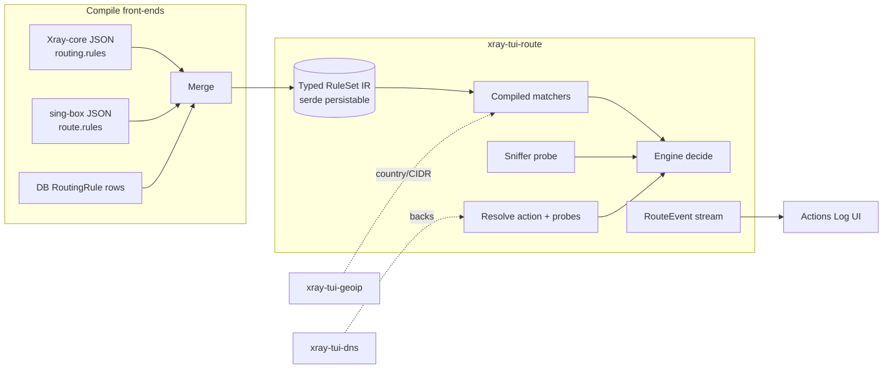

# Native Routing Engine — Design Spec

**Status:** draft for review
**Date:** 2026-08-27
**Crate:** `xray-tui-route` (new)
**Decision basis:** `docs/routing-engine-decision.md` (Option C — hybrid), upstream research summarized there.
**User decisions locked:**

1. The router is a **standalone engine**: `decide(conn_meta) -> Decision`. No inbound listener assumed; callable from any consumer and directly from tests. The engine performs no I/O on its own connection: sniffing needs a byte prefix which the caller supplies via `ConnMeta.payload_prefix` after consulting `Engine::needs_sniff()`; the caller replays consumed bytes into the tunnel itself.
2. Sniffed SNI / route decisions surface in the **Actions Log** panel via events.
3. The IR is **native-only**. Spawned-core config generation keeps the existing `RoutingRule` JSON pass-through untouched. New front-ends **parse sing-box and xray-core rule sets and merge them into one native ruleset**.
4. Resolver failure on configured **must-resolve probe hostnames** emits a network-breakdown marker event (real-time link health signal). A future *fast-switch* task (out of scope here) will consume these markers to reconnect via nearest inbound/outbound.

---

## 1. Purpose

Give `xray-tui-native` traffic a first-class routing layer with upstream parity:
ordered first-match rule evaluation over composable matchers, terminal actions
(route, reject, hijack-dns), default-outbound fallback, lazy DNS, and
compile-front-ends that ingest xray-core and sing-box routing configs.

Out of scope (explicitly deferred; land as `RouteError::Unsupported` errors where an arm
would live, preserving native's explicit-absence principle):

- Balancers + observatory strategies (needs multi-profile aliveness infrastructure — separate SP).
- Xray `.dat` protobuf geodata assets (`geosite:`/`geoip:` tokens resolve only when the
  consumer supplies plain-text lists through the item payload or the geoip feature).
- SRS/local/remote rule-set references (sing-box `rule_set`) until the R7 accelerators phase.
- QUIC sniffer, process/user/wifi/package matchers, clash-mode, auth-user (no local counterpart yet).
- TUN/system-proxy integration, fast-switch reconnect logic (marked future task by user).
- Changing spawned-core config builders.

## 2. Architecture



Data flow:

1. **Load**: one or more configs (JSON strings/files in either dialect, or Settings→Routing rows) → `compile_*` → `RuleSet` IR. Multiple sources **merge** into one `RuleSet` (ordering policy in §5).
2. **Build**: `Engine::build(rule_set)` compiles matchers once (exact-map + suffix map + optional AC automaton, CIDR prefix trees) — zero allocation on the hot path.
3. **Decide**: caller fills `ConnMeta` (target, port, network, optional source info, optional pre-read `payload_prefix`, cached resolved IPs) and calls `engine.decide(&mut meta)`. Match evaluation mutates only the meta; terminal actions return a `Decision`.
4. **Execute**: caller maps `Decision::Route{tag}` through its own outbound registry (tag → `NativeConnectParams`/direct/dialer); diverts udp/:53 on `Decision::HijackDns` using the crate's resolver adapter if desired. Engine stays dialer-free and testable standalone.

## 3. Crate layout

```
crates/xray-tui-route/src/
├── lib.rs          # public API re-exports, crate docs
├── addr.rs         # NetAddr = Host(Ip|Domain) + Port; mirrors native's TargetAddr shape
│                   #   (own type on purpose: no dep on xray-tui-native; From impls both ways)
├── ir.rs           # MatchItem, Cond, Action, Rule, RuleSet (+ serde)
├── compiler/
│   ├── mod.rs      # merge(): concatenation + tag-collision policy
│   ├── xray.rs     # xray JSON routing block -> IR
│   └── singbox.rs  # sing-box route block -> IR
├── matchers.rs     # DomainMatcher (exact HashMap, suffix map, keyword AC, regex set),
│                   # CidrSet (v4/v6 prefix trees), PortRange, NetworkMask
├── engine.rs       # Engine, ConnMeta, Decision, evaluation loop, AND/OR/invert evaluation
├── sniff.rs        # TLS ClientHello SNI parse + HTTP Host over bounded leading bytes
├── resolve.rs      # resolver seam + TTL cache + must-resolve probes
├── events.rs       # RouteEvent enum
└── error.rs        # RouteError (thiserror)
```

The DB-row → IR converter lives in the **TUI crate** (where `xray-tui-db` types already flow);
`xray-tui-route` exposes pure `RuleSet` construction so no db dependency leaks into this crate.

Dependencies: `serde`/`serde_json`, `thiserror`, `aho-corasick` (already a workspace dep),
`regex` (single-crate dep declared in this crate's own manifest per root manifest style).
Feature-gated integration deps: `dns` feature → `xray-tui-dns` production resolver adapter;
`geoip` feature → `xray-tui-geoip` country-code resolution for `geoip:cc`.

## 4. Typed IR

```rust
pub struct RuleSet {
    pub rules: Vec<Rule>,
    pub default: DefaultRoute,             // Route(tag) | Reject(method)
    pub resolve_strategy: ResolveStrategy, // AsIs | IfNonMatch
    pub probes: Vec<String>,               // must-resolve probe hostnames (user decision 4)
}

pub struct Rule {
    pub name: Option<String>,              // informational; shows in Actions Log
    pub cond: Cond,                        // flat AND of items, or logical combinator
    pub action: Action,
}

pub enum Cond {
    All(Vec<MatchItem>),                   // upstream-flat rules: every item must hold
    Any(Vec<Cond>),                        // logical OR nesting
    Invert(Box<Cond>),                     // negation
}

pub enum MatchItem {
    Domain { exact: Vec<String>, suffix: Vec<String>, keywords: Vec<String>, regexes: Vec<String> },
    IpCidr { cidrs: Vec<Cidr>, private: bool, geo_country: Vec<String> },
    // payload mirrors IpCidr; matches only when caller supplied source metadata:
    SourceIpCidr { cidrs: Vec<Cidr>, private: bool, geo_country: Vec<String> },
    Ports(Vec<PortRange>),
    SourcePorts(Vec<PortRange>),
    Network(NetworkMask),                  // tcp/udp bits
    Protocol(SniffedProtocol),             // http/tls/dns — derived from payload_prefix or meta.sniff
    InboundTag { tags: Vec<String> },
    OutboundTag { tags: Vec<String> },     // prior chained decision carried in ConnMeta
}

pub enum Action {
    Route { tag: String, override_addr: Option<NetAddr> },
    Reject { method: RejectMethod },       // Drop | DefaultReply
    HijackDns,                             // terminal Decision::HijackDns
}
```

Note: upstream `sniff`/`resolve` are interleaved mid-chain *actions*; here they are **needs
declarations**, not rules' terminal actions. After `build()`, the engine exposes
`needs_sniff()`/`needs_resolve()` (true when any item references sniffed protocols or IP-based
matching may require resolution). Callers use them to lazily fetch a payload prefix or run a
resolve before/inside `decide()` — the engine stays I/O-free while parity behavior is preserved.
Rules remain terminal-action-only.

Xray vocabulary mapping (`compiler/xray.rs`) — pinned by fixture tests:

| Xray JSON | IR |
|---|---|
| `domains`: exact / `domain:` suffix / `keyword:` / `regexp:` / `ext:`-file lines | `MatchItem::Domain` fields |
| `ips`: CIDRs, `geoip:private` | `MatchItem::IpCidr` |
| `ports`, `sourcePorts`: `"80"`, `"1000-2000"` | `PortRange` list |
| `network` `"tcp","udp","tcp,udp"` | `NetworkMask` |
| `inboundTag` list | `InboundTag` |
| `protocol` prefixes (http/tls/dns) | `Protocol` |
| config-level `domainStrategy`: AsIs / IpIfNonMatch / IpOnDemand | `resolve_strategy` (IpOnDemand ≡ IfNonMatch with eager first-decide need flag) |
| `outboundTag` target | `Action::Route{tag}` |
| no rule matched | `RuleSet.default` |

sing-box vocabulary mapping (`compiler/singbox.rs`) — same table style:

| sing-box JSON | IR |
|---|---|
| `domain` / `domain_suffix` / `domain_keyword` / `domain_regex` | `MatchItem::Domain` fields |
| `ip_cidr` | `MatchItem::IpCidr.cidrs` |
| `ip_is_private` | `IpCidr.private` = RFC1918+CGNAT+loopback+link-local+ULA set |
| `port` / `port_range` (`"1000:2000"` colon syntax) | `PortRange` (colon→dash normalized) |
| `source_ip_cidr` / `source_port` | Source variants |
| `network` | `NetworkMask` |
| `inbound` / `outbound` | InboundTag / OutboundTag |
| `protocol` | `Protocol` |
| logical `{mode:"and"/"or", rules:[…], invert}` | `Cond::All/Any/Invert` nesting |
| `action: route/reject/hijack-dns` | `Action` arms (`bypass`/`direct` collapse onto `Route{tag:"direct"}` registry convention shared with the TUI outbound registry) |
| `action: reject.method drop/default` | `RejectMethod::Drop/DefaultReply` |
| `sniff` / `resolve` pseudo-actions | folded into `needs_sniff`/`needs_resolve` declarations (see note above) |
| `rule_set` refs, dns-router-specific rule blocks | `RouteError::Unsupported` at compile time |

DB rows (Settings→Routing): implemented in the TUI crate as `impl From<&RoutingRule> for Rule`
compiling the existing columns losslessly into flat `Cond::All` rules.

## 5. Engine semantics

Evaluation loop (mirrors upstream linear first-match):

1. For each rule in order: evaluate `cond` against current meta state.
2. Terminal hit returns immediately: see `Decision`.
3. No rule matched: if `resolve_strategy == IfNonMatch`, resolve target host once via the resolver
   seam, store IPs into meta, then run the loop once more with a cycle-guard preventing further
   resolution; then fall to `default`.

```rust
pub enum Decision {
    Route { tag: String, override_addr: Option<NetAddr> },
    Reject { method: RejectMethod },
    HijackDns,
}
pub enum RejectMethod { Drop, DefaultReply }
```

Merge semantics (`compiler/mod.rs`): N sources merge with `rules` concatenated in
source-argument order (first-listed source wins conflicts). Tag collisions: later colliders get
a `-<source-index>` suffix and all their internal references remap. Conflicting non-fallback
defaults: last one wins plus one `CompileWarning` event.

Performance: matchers compiled at `build()`; hot path does hash lookups + prefix-tree walks +
optional AC automaton scans only; zero allocation unless events fire. An LRU decision cache
(shoes precedent: enable past >16 rules) lands behind a feature flag in R7.

## 6. Error handling

- Malformed input config aborts compilation with positional `RouteError::Parse{rule_index, field, message}`. Never silently skip a rule.
- Unknown upstream fields tolerated, collected into warnings surfaced as `CompileWarning` events.
- Matcher validity enforced eagerly in `build()`: regex compilation, port-range sanity, private-set availability, protocol whitelist. Unsupported capability = error at build; nothing partial at `decide()` time.
- Runtime resolve failures are not errors: a miss degrades to AsIs matching for that connection. Probe failure specifics below.

### Network breakdown markers (user decision 4)

- `RuleSet.probes` holds must-resolve hostnames (compiled from dialect files too: both parsers accept a top-level extension key `xray-tui-probes`).
- After each resolve attempt a background streak tracker updates consecutive-failure counts per probe; entering failure emits `RouteEvent::NetworkBreakdown { failed_probe }`; next success emits `RouteEvent::ProbeRecovered { probe }` and resets the streak. Exactly-once per transition.
- No behavioral change to decisions today. Fast-switch consumption stays a spec-level annotation only — deliberately not code.

## 7. Events

Timestamps use `jiff::Timestamp` (workspace standard).

```rust
pub enum RouteEvent {
    DecisionApplied { rule_name: Option<String>, tag: Option<String>, sni: Option<String>, at: Timestamp },
    Resolved { host: String, ips: Vec<IpAddr>, at: Timestamp },
    NetworkBreakdown { failed_probe: String, at: Timestamp },
    ProbeRecovered { probe: String, at: Timestamp },
    CompileWarning { rule_index: usize, message: String },
}
```

Delivery: `mpsc::UnboundedSender<RouteEvent>` passed via `Engine::with_events(sender)`. The TUI maps these onto its existing core-event fan-out so the Actions Log (`ui/actions_log.rs`) shows DecisionApplied lines including sniffed SNI per active connection.

## 8. Verification plan

Mirrors NATIVE_CORE.md tiering:

- **Tier 1 (CI gate, hermetic)** — `cargo test -p xray-tui-route --lib` (+ integration tests in-crate):
  - Golden truth tables: flat first-match ordering, default fallback, nested OR/invert matrix (ported subset of upstream `rule_abstract_test.go` cases).
  - Compiler fixtures: real xray-core + sing-box JSON samples captured verbatim from thirdparty docs/tests committed under `crates/xray-tui-route/tests/fixtures/`; assert golden IR output; serde roundtrip stability of merged `RuleSet`s.
  - Merge tests: collision renames, cross-reference remaps, conflict-default warn-once.
  - Sniffer byte fixtures: padded/TLS-fragmented ClientHello, HTTP Host variants, chunk-split reads, negative cases (no bytes within deadline).
  - Resolver battery vs fake sink: strategies, TTL cache semantics, cycle guard, probe fail/recover exactly-once-per-streak.
- **Tier 3 hooks** — e2e rows defined at R8 when TUI wiring exists (same staged approach used by the vless/vmess axes: real cores validate the full dial-through-routed-tag path).

## 9. Implementation phases

| Phase | Deliverable | Gate |
|---|---|---|
| R1 | Crate scaffold + `ir.rs` + flat `Cond::All` engine loop + seed matchers (domain/cidr/port/network/inbound_tag/protocol), default fallback, truth tables | tier-1 green, clippy pedantic clean |
| R2 | `compiler/{xray,singbox}.rs` + merge; committed fixture JSONs | fixtures verify golden IR |
| R3 | TUI-crate converter: Settings→Routing rows → IR, lossless column coverage tests | each RoutingRule column exercised |
| R4 | `resolve.rs` resolver seam + strategies + TTL cache + cycle guard + probes emitting breakdown/recovered events | fake-sink battery incl. streak-reset case |
| R5 | `sniff.rs` + payload-prefix contract + meta rewrite; wired DecisionApplied events | byte-fixture suite green |
| R6 | `Cond::Any/Invert` evaluator completing the logical model | nested-inversion truth-table battery |
| R7 | Accelerators behind feature flags if benches justify: AC trie swap-in, radix CidrSet, LRU decision cache | bench before/after notes under .benchmarks |
| R8 | Events bridge → CoreEvent fan-out → Actions Log surfacing (SNI per active connection) + probes editor in Settings→Routing form | manual TUI smoke: routed profile connect shows DecisionApplied entries with SNI + tag |

Deferred stubs (`RouteError::Unsupported`): balancers, `.dat` geodata, SRS rule-sets, QUIC sniffer, process/user/wifi/package matchers, clash-mode/auth-user.
